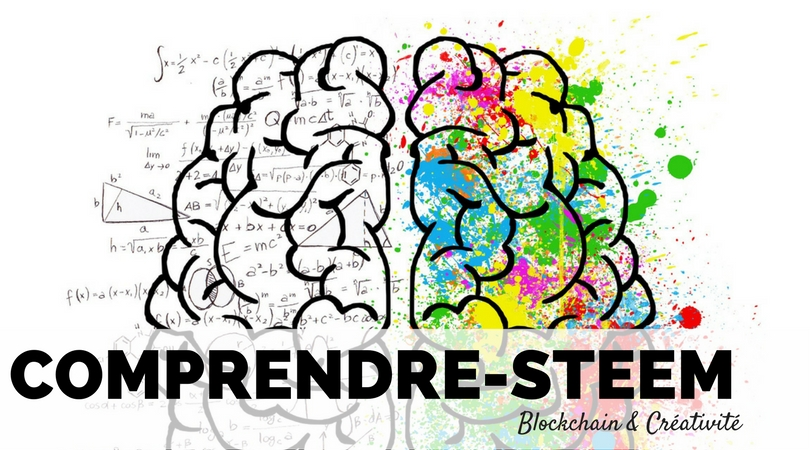

# Comprendre-steem.fr

Ce repository contient le code source du site comprendre-steem.fr.

**Comprendre-Steem.fr** est une plateforme qui à pour but d’indexer un ensemble de ressources permettant de mieux comprendre la blockchain Steem afin de l’utiliser à son plein potentiel.

La plateforme Steem présente un bel équilibre entre la technologie et la créativité. Cette plateforme vous dirigera vers des articles et des vidéos qui vous permettrons de mieux comprendre la partie technologique afin d’exprimer au mieux votre créativité.

## Remerciements

Tout d’abord merci aux auteurs francophones qui participent à la rédaction et à la curation des articles en français.

Merci également à [Bootstrapious.com](https://bootstrapious.com/free-templates) pour le le template du site et à [Kishan B](https://github.com/kishaningithub) qui l’a rendu compatible avec [l’outil hugo](https://gohugo.io/).

## License

Le code source est disponible sous license MIT, voir fichier LICENSE.

